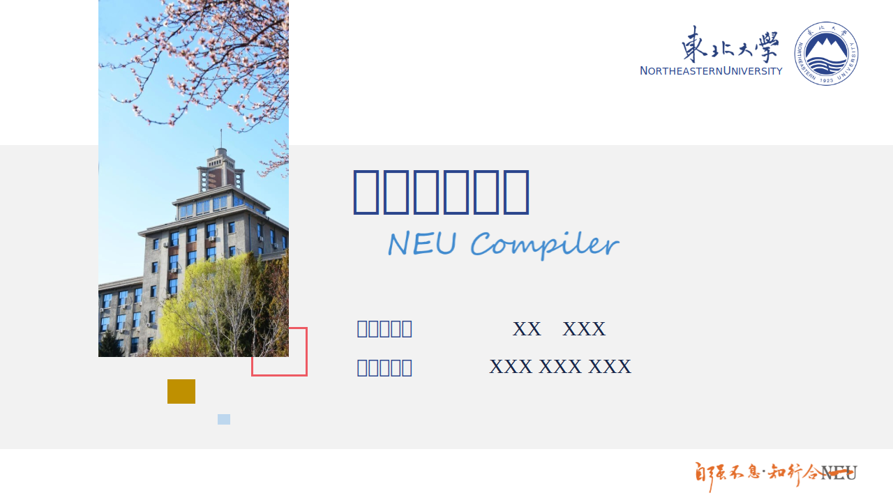
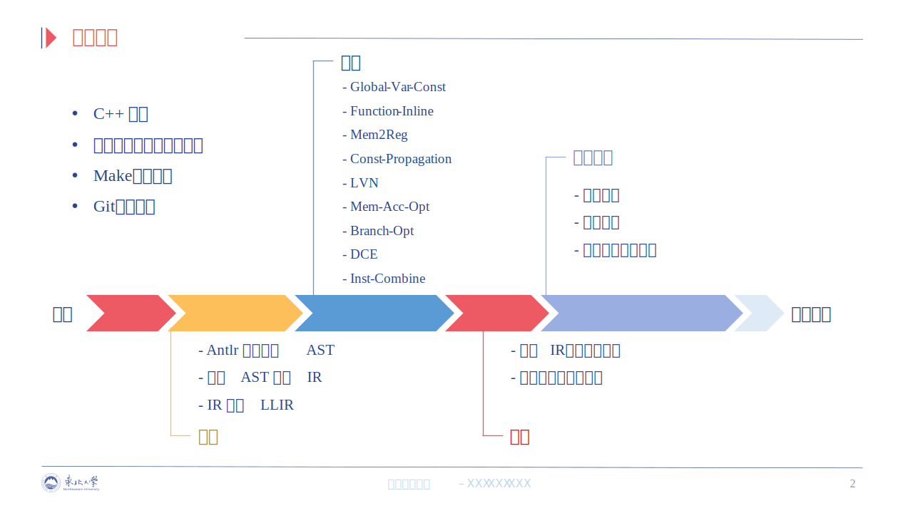
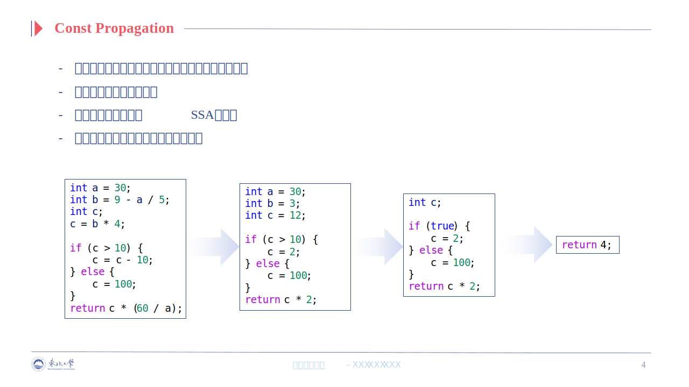
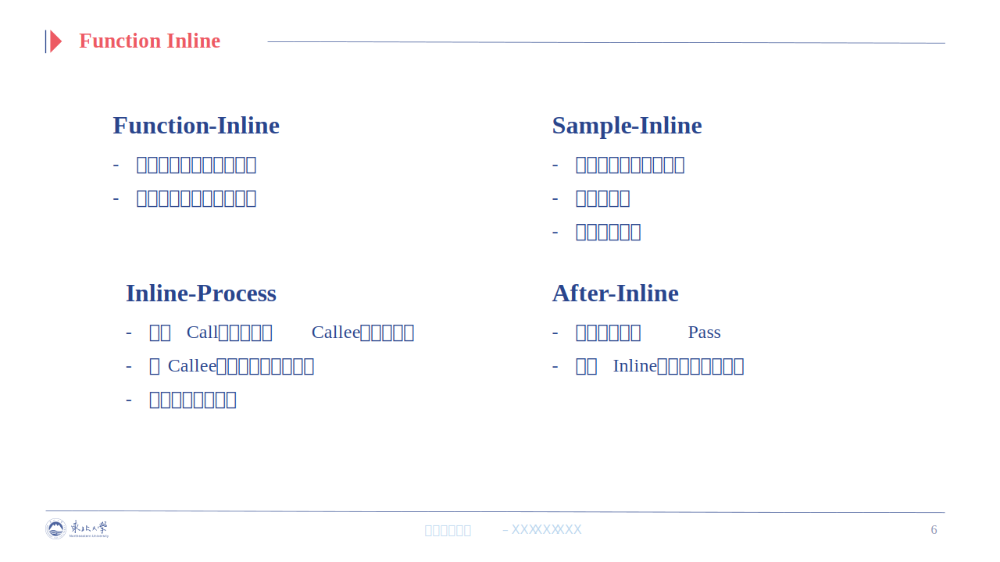
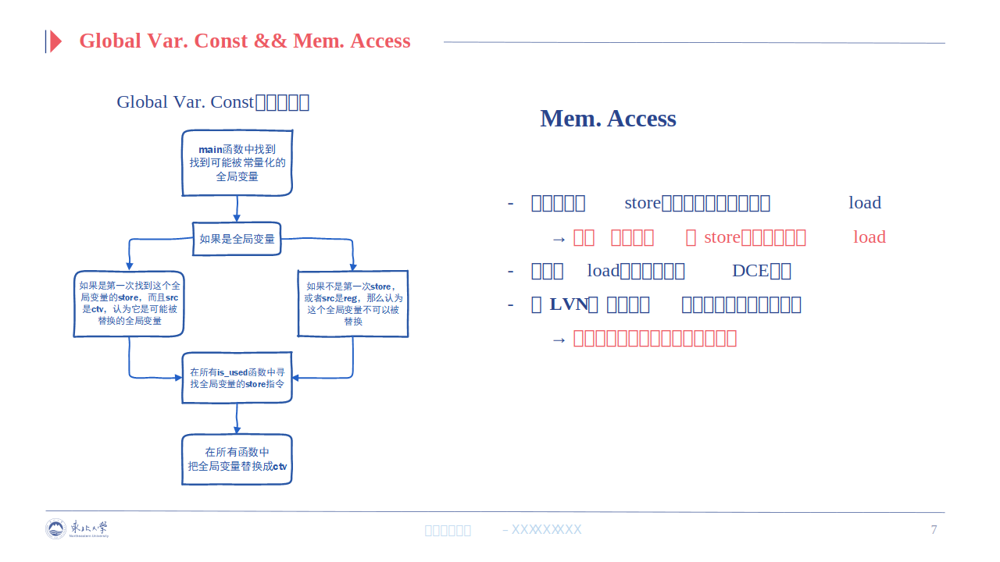
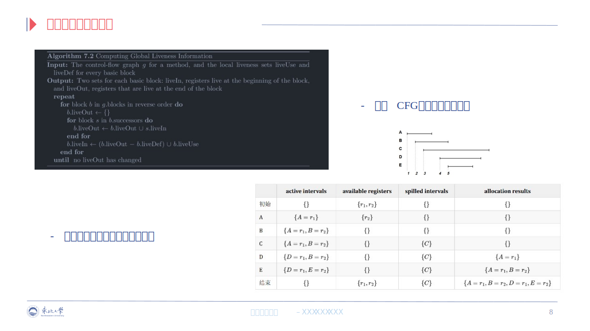
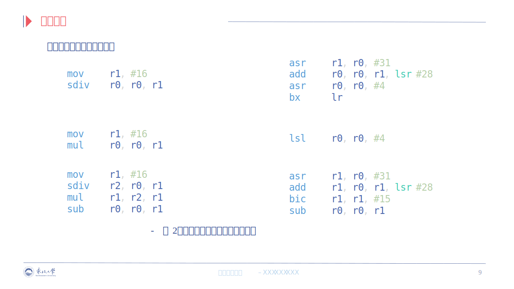

---
github:
  is_project_page: true
  repository_url: https://github.com/cocodery/SysYCompiler
  repository_name: SysYCompiler
---

# C语言(子集)至armv7编译器——恩毅优肯派勒

---

## 关于

&emsp;&emsp;本项目为2022全国大学生计算机系统能力大赛编译系统设计赛(华为毕昇杯)参赛作品，开发周期为2022年6月至2022年8月。最终该作品在全国总决赛中获得三等奖(特等、一等、二等奖共9支队伍，共153支队伍参赛)。在多数用例中，该作品的优化能力与gcc -O1类似。笔者在团队中主要负责编译器后端(IR至汇编)和部分优化。

## 技术栈

* C++
* Arm汇编
* llvm
* Antlr
* Linux
* git
* cmake

## Demo

<table>
  <tr>
    <th>源程序</th>
    <th>汇编</th>
  </tr>
  <tr>
    <td style="text-align: left;">


int main() {
    int a, b;
    a = 070;
    b = 0x4;
    a = a - - 4 + + b;
    if (+-!!!a) {
        a = - - -1;
    }
    else {
        a = 0 + + b;
    }
    putint(a);
    return 0;
}


    </td>
    <td style="text-align: left;">


.text
.global main
main: 
main_push_lr: 
    push {lr}
    sub sp, sp, #4
main_block_1: 
     // br label %Block5
    /*b main_block_5*/
main_block_5: 
     // call void @putint(i32 4)
    mov r0, #4
    bl putint
     // ret i32 0
    mov r0, #0
    add sp, sp, #4
    pop {pc}


    </td>
  </tr>
</table>

&emsp;&emsp;这里展示的只是一个很简单的例子，该语法还支持函数调用、浮点、数组、指针等功能。[详细语法定义](https://gitlab.eduxiji.net/nscscc/compiler2022/-/blob/master/SysY2022%E8%AF%AD%E8%A8%80%E5%AE%9A%E4%B9%89-V1.pdf)

## 答辩PPT

## 实现细节

  
<u style="color: #2879d0;">使用LLVM所使用的线性扫描算法分配寄存器</u>


// 删除旧变量的分配
for (auto activeIntervalIndexIt = activeIntervals.begin();
    activeIntervalIndexIt != activeIntervals.end();) {
  auto rangeEnd = func.LiveInterval.at(*activeIntervalIndexIt).second;
  bool src_needed = InstNeedsSrcPreserved(func.all_insts[rangeEnd]);
  if (src_needed && rangeEnd < varRange.first || !src_needed && rangeEnd <= varRange.first) {
    availRegs.insert(func.AllocationResult.at(*activeIntervalIndexIt));
    activeIntervalIndexIt = activeIntervals.erase(activeIntervalIndexIt);
  }
  else {
    ++activeIntervalIndexIt;
  }
}
// 给新变量分配寄存器或溢出
for (auto activeIntervalIndexIt = activeIntervals.begin();
    ; ++activeIntervalIndexIt) {
  // 找到插入位置
  if (activeIntervalIndexIt == activeIntervals.end()
    || func.LiveInterval.at(*activeIntervalIndexIt).second > varRange.second)
  {
    activeIntervals.insert(activeIntervalIndexIt, varIndex);
    // 无可用寄存器，把活跃区间右侧最靠后的变量溢出，腾出寄存器
    if (availRegs.empty()) {
      auto &&spilled_var_idx = activeIntervals.back();
      if (varIndex != spilled_var_idx) {
        availRegs.insert(func.AllocationResult.at(spilled_var_idx));
        func.AllocationResult.at(spilled_var_idx) = SPILL;
      }
      else {
        func.AllocationResult.insert(make_pair(spilled_var_idx, SPILL));
      }
      activeIntervals.pop_back();
    }
    // 分配可用寄存器
    auto alloc_res = *availRegs.begin();
    func.AllocationResult.insert(make_pair(varIndex, alloc_res));
    availRegs.erase(alloc_res);
    break;
  }
}


  
<u style="color: #2879d0;">生成变量的活跃信息</u>


for (auto &&bbPtr : functionPtr->all_blocks) {
  for (auto &&instPtr : bbPtr->basic_block) {
    vector <int32_t> src_regids;
    int32_t dst_regid = INT32_MIN;
    ProcessInst(src_regids, dst_regid, instPtr);
    for (auto &&src_regid : src_regids)
      if (bbPtr->LiveDef.find(src_regid) == bbPtr->LiveDef.end())
        bbPtr->LiveUse.insert(src_regid);
    if (dst_regid != INT32_MIN)
      bbPtr->LiveDef.insert(dst_regid);
  }
}
bool liveOutChanged;
do {
  liveOutChanged = false;
  for (auto &&it = functionPtr->all_blocks.rbegin();
      it != functionPtr->all_blocks.rend();
      ++it) {
    auto &&bPtr = *it;
    size_t oldSiz = bPtr->LiveOut.size();
    bPtr->LiveOut.clear();
    for (auto &&sPair : bPtr->succs) {
        auto &&sPtr = sPair.second;
        bPtr->LiveOut.insert(sPtr->LiveIn.begin(), sPtr->LiveIn.end());
    }
    if (!liveOutChanged && bPtr->LiveOut.size() != oldSiz)
        liveOutChanged = true;
    bPtr->LiveIn.clear();
    set_difference(bPtr->LiveOut.begin(),  bPtr->LiveOut.end(),
                    bPtr->LiveDef.begin(),  bPtr->LiveDef.end(),
                    inserter(bPtr->LiveIn, bPtr->LiveIn.begin()));
    bPtr->LiveIn.insert(bPtr->LiveUse.begin(), bPtr->LiveUse.end());
  }
} while (liveOutChanged);


  
<u style="color: #2879d0;">使用enum来实现对指令、寄存器等的编号</u>


enum REGs {
  r0,  r1,  r2,  r3,  r4,  r5,  r6,  r7,  r8,  r9, r10, r11, r12,  sp,  lr,  pc,
  s0,  s1,  s2,  s3,  s4,  s5,  s6,  s7,  s8,  s9, s10, s11, s12, s13, s14, s15,
  s16, s17, s18, s19, s20, s21, s22, s23, s24, s25, s26, s27, s28, s29, s30, s31,
  SPILL, NOALLOC
};
static enum AsmBranchType{LT, GE, LE, GT, EQ, NE, AlwaysTrue, AlwaysFalse} b_type;
#define REVERSED_BRANCH_TYPE(_BT) ((AsmBranchType)(((char)_BT & 0xfe) | (~(char)_BT & 1)))


  
<u style="color: #2879d0;">使用LUT高效查找把32位整数拆分成arm中Operand2的最优方式</u>


const uint32_t operand2_mask_unsigned[] = {
  0x000000ff, 0xc000003f, 0xf000000f, 0xfc000003,
  0xff000000, 0x3fc00000, 0x0ff00000, 0x03fc0000,
  0x00ff0000, 0x003fc000, 0x000ff000, 0x0003fc00,
  0x0000ff00, 0x00003fc0, 0x00000ff0, 0x000003fc
};
vector<int32_t> SplitInt(int32_t to_split) {
  const int n = 16, w = 4;
  const int32_t *mask = (const int32_t *)operand2_mask_unsigned;
  /* ... */
  for (int i = 0; i < n - 2 * w; ++i)
    for (int j = i + w; j < std::min(i + n - 2 * w + 1, n - w); ++j)
      for (int k = j + w; k < std::min(i + n - w + 1, n); ++k)
        if ((to_split & (mask[i] | mask[j] | mask[k])) == to_split)
          return {to_split & mask[i], to_split & mask[j], to_split & mask[k]};
  return {to_split & mask[0], to_split & mask[w], to_split & mask[2 * w], to_split & mask[3 * w]};
}


  
<u style="color: #2879d0;">对于与2的次幂相关的乘除模运算优化</u>


if (__builtin_popcount(src2.val.i) == 1) { // 2, 4, 8, 16...
  asm_insts.push_back(AsmCode(AsmInst::LSL, {Param(r), src1, Param(ffs(src2.val.i) - 1)}, indent));
  return;
}
else if (__builtin_popcount(src2.val.i - 1) == 1) { // 3, 5, 9, 17, 33...
  asm_insts.push_back(AsmCode((src2.val.i - 1 < 0) ? AsmInst::SUB : AsmInst::ADD, {Param(r), src1, src1, Param(Param::Str, LSL_HASHTAG_NUMBER(ffs(src2.val.i - 1) - 1))}, indent));
  return;
}
else if (__builtin_popcount(src2.val.i + 1) == 1) { // 7, 15, 31...
  asm_insts.push_back(AsmCode(AsmInst::RSB, {Param(r), src1, src1, Param(Param::Str, LSL_HASHTAG_NUMBER(ffs(src2.val.i + 1) - 1))}, indent));
  return;
}
else if (__builtin_popcount(src2.val.i) == 2) { // 6, 10, 18, 34, 66, 320, 8320...
  /* ...... */
}
else if (__builtin_popcount(1 - src2.val.i) == 1) { // -3, -7, -15, -31...
  /* ...... */
}
else if (__builtin_popcount(- 1 - src2.val.i) == 1) { // -5, -9, -17, -33...
  /* ...... */
}
else if (__builtin_popcount((1 << (32 - __builtin_clz(abs(src2.val.i)))) - abs(src2.val.i)) == 1) { // +-14, +-28, +-30, +-56, +-60...
  /* ...... */
}


