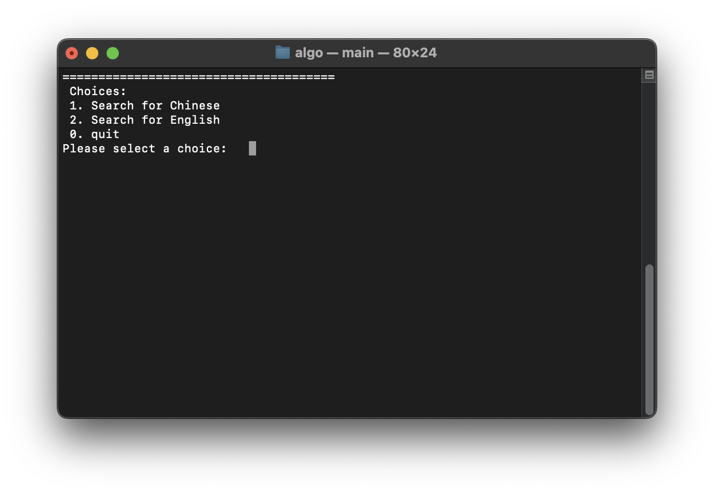
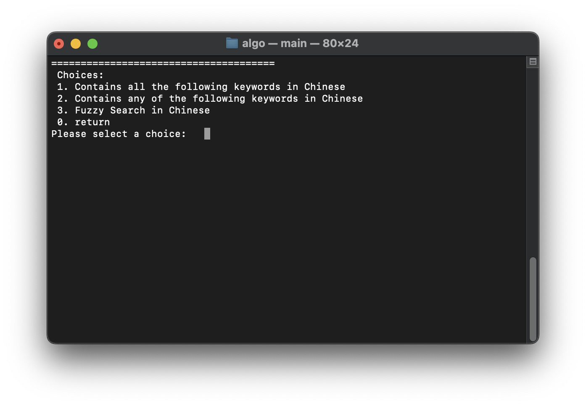
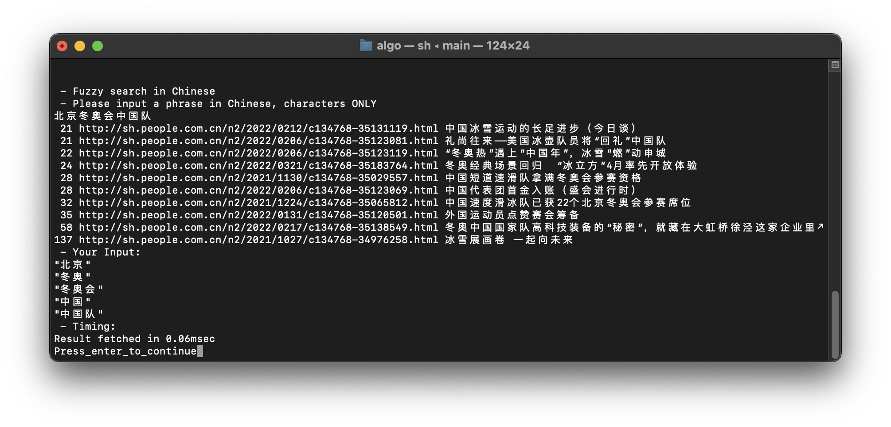
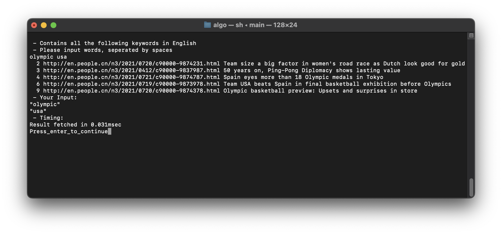

---
github:
  is_project_page: true
  repository_url: https://github.com/w43322/algoSearchEngine
  repository_name: algoSearchEngine
---

# 小型中英文搜索引擎

---

## Demo

* 运行程序，首先选择搜索语言(搜索数据为之前提前爬取的人民网新闻)

  

* 选择语言后，可以选择搜索模式，分别为全部关键字、任意关键字和模糊搜索(使用“结巴”库)

  

* 中文搜索示例

  

* 英文搜索示例

  

## 实现细节

  
<u style="color: #2879d0;">索引用异或滚动哈希实现，且用位运算代替乘法和模，效率极高</u>


static uint16_t GetHash16(const std::string& str) {
  uint16_t hash = 0;
  size_t len = str.length();
  for (size_t i = 0; i + 1 < len; i += 2) {
      uint16_t word = (str[i] << 8) | (uint8_t)str[i | 1];
      size_t k = ((len + 1 - i) >> 1) - 1;
      hash ^= (word << (k & 0xf)) | (word >> (-k & 0xf));
  }
  if (len & 1) {
    hash ^= str[len - 1] << 8;
  }
  return hash;
}


  
<u style="color: #2879d0;">生成倒排索引时把数据压入一个64位整型，提高运算效率</u>


InvertedIndex(std::vector<uint64_t>& tempIndex) {
  radixSortHighLow(&tempIndex[0], tempIndex.size());
  
  size_t siz = -1; // 上一个word_id
  for (auto&& record : tempIndex) { // 遍历临时索引
    uint32_t wordId = record >> 32; // 临时索引中当前记录的word_id
    uint32_t docId = record; // 临时索引中当前记录的doc_id
    if (wordId == siz) { // 如果当前word_id等于上个word_id，在上个元素的尾部继续处理doc_id
      auto&& docListOfCurrentWord = data.back(); // 取尾部元素
      if ((uint32_t)(docListOfCurrentWord.back() >> 32) == docId) { // 如果当前doc_id等于上一个doc_id，即当前单词在当前文档中又出现了一次
        ++docListOfCurrentWord.back(); // 增加这个文档中这个单词出现的次数
      } else { // 当前doc_id不等于上一个doc_id
        docListOfCurrentWord.push_back(((uint64_t)docId << 32) | 1); // 在当前word_id尾部加入新的doc_id节点
      }
    }
    else { // 当前word_id不等于上一个word_id
      ++siz;
      data.push_back({((uint64_t)docId << 32) | 1}); // 增加新的word_id节点
    }
  }
}


  
<u style="color: #2879d0;">使用基数排序，经测试比std::sort快3倍</u>


typedef union {
  struct {
    uint32_t c8[256];
    uint32_t c7[256];
    uint32_t c6[256];
    uint32_t c5[256];
    uint32_t c4[256];
    uint32_t c3[256];
    uint32_t c2[256];
    uint32_t c1[256];
  };
  uint32_t counts[256 * 8];
} rscounts_t;

uint64_t * radixSortHighLow(uint64_t * array, uint32_t size) {
  rscounts_t counts;
  memset(&counts, 0, 256 * 8 * sizeof(uint32_t));
  uint64_t * cpy = (uint64_t *)malloc(size * sizeof(uint64_t));
  uint32_t o8=0, o7=0, o6=0, o5=0, o4=0, o3=0, o2=0, o1=0;
  uint32_t t8, t7, t6, t5, t4, t3, t2, t1;
  uint32_t x;
  // 计算每8位中每种“情况(0到255之一)”出现的次数
  for(x = 0; x < size; x++) {
    t8 = array[x] & 0xff;
    t7 = (array[x] >> 8) & 0xff;
    t6 = (array[x] >> 16) & 0xff;
    t5 = (array[x] >> 24) & 0xff;
    t4 = (array[x] >> 32) & 0xff;
    t3 = (array[x] >> 40) & 0xff;
    t2 = (array[x] >> 48) & 0xff;
    t1 = (array[x] >> 56) & 0xff;
    counts.c8[t8]++;
    counts.c7[t7]++;
    counts.c6[t6]++;
    counts.c5[t5]++;
    counts.c4[t4]++;
    counts.c3[t3]++;
    counts.c2[t2]++;
    counts.c1[t1]++;
  }
  // 把基数转换为偏移量
  for(x = 0; x < 256; x++) {
    t8 = o8 + counts.c8[x];
    t7 = o7 + counts.c7[x];
    t6 = o6 + counts.c6[x];
    t5 = o5 + counts.c5[x];
    t4 = o4 + counts.c4[x];
    t3 = o3 + counts.c3[x];
    t2 = o2 + counts.c2[x];
    t1 = o1 + counts.c1[x];
    counts.c8[x] = o8;
    counts.c7[x] = o7;
    counts.c6[x] = o6;
    counts.c5[x] = o5;
    counts.c4[x] = o4;
    counts.c3[x] = o3;
    counts.c2[x] = o2;
    counts.c1[x] = o1;
    o8 = t8; 
    o7 = t7; 
    o6 = t6; 
    o5 = t5; 
    o4 = t4; 
    o3 = t3; 
    o2 = t2; 
    o1 = t1;
  }
  // 基数排序
  for(x = 0; x < size; x++) {
    t8 = array[x] & 0xff;
    cpy[counts.c8[t8]] = array[x];
    counts.c8[t8]++;
  }
  for(x = 0; x < size; x++) {
    t7 = (cpy[x] >> 8) & 0xff;
    array[counts.c7[t7]] = cpy[x];
    counts.c7[t7]++;
  }
  for(x = 0; x < size; x++) {
    t6 = (array[x] >> 16) & 0xff;
    cpy[counts.c6[t6]] = array[x];
    counts.c6[t6]++;
  }
  for(x = 0; x < size; x++) {
    t5 = (cpy[x] >> 24) & 0xff;
    array[counts.c5[t5]] = cpy[x];
    counts.c5[t5]++;
  }
  for(x = 0; x < size; x++) {
    t4 = (array[x] >> 32) & 0xff;
    cpy[counts.c4[t4]] = array[x];
    counts.c4[t4]++;
  }
  for(x = 0; x < size; x++) {
    t3 = (cpy[x] >> 40) & 0xff;
    array[counts.c3[t3]] = cpy[x];
    counts.c3[t3]++;
  }
  for(x = 0; x < size; x++) {
    t2 = (array[x] >> 48) & 0xff;
    cpy[counts.c2[t2]] = array[x];
    counts.c2[t2]++;
  }
  for(x = 0; x < size; x++) {
    t1 = (cpy[x] >> 56) & 0xff;
    array[counts.c1[t1]] = cpy[x];
    counts.c1[t1]++;
  }
  free(cpy);
  return array;
}


## 技术栈

* C++
* CppJieba

## 关于

&emsp;&emsp;本项目为东北大学计算机学院算法设计与分析课程设计，完成于2022年6月。
