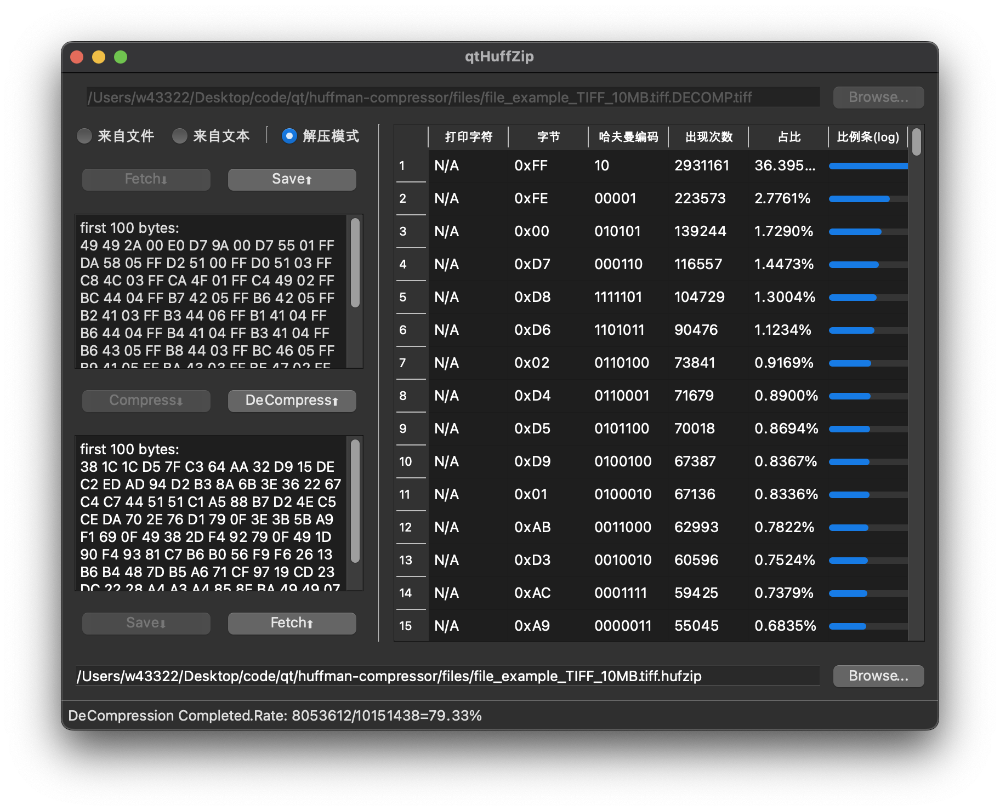

---
github:
  is_project_page: true
  repository_url: https://github.com/w43322/huffman-compressor
  repository_name: huffman-compressor
---

# 哈夫曼编码实现压缩软件

---

## 软件功能

### 压缩文件

* 显示十六进制文件头

* 统计哈夫曼树的信息

* 显示压缩比

  

### 压缩纯文本内容

* 可以随机生成文本

  

### 解压缩

* 根据压缩包重建哈夫曼树，再重建文件

  

## 技术栈

* C++
* Qt

## 关于

&emsp;&emsp;本项目为东北大学计算机学院数据结构课程设计，完成于2021年12月。
