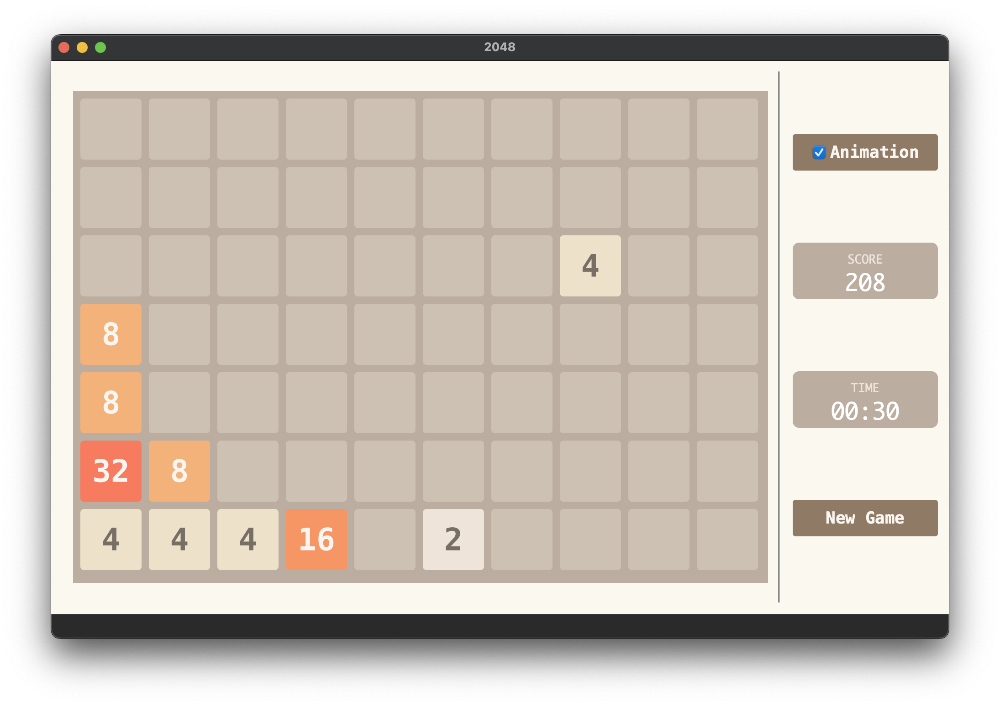

---
github:
  is_project_page: true
  repository_url: https://github.com/w43322/q2048Klotski
  repository_name: q2048Klotski
---

# 带AI的2048和华容道小游戏

---

## 2048 Gameplay & AI Demo


## 华容道 Gameplay Demo


## 亮点

### AI

* 针对4*4的2048游戏，把棋盘压缩为一个64位整数，使其在现代64位处理器中能够储存在一个寄存器内，提高效率

* 使用Expecimax算法，为Minimax算法的一种变体，最大搜索深度为8层，每秒能计算5到20步

* 胜率

|达成的格子最大值|概率|
|:-----------:|:-:|
|2048        |100%|
|4096        |100%|
|8192        |100%|
|16384        |94%|
|32768        |36%|

### 总体设计

* 2048和华容道游戏本体使用统一的基类，该基类可以扩展到其他格子游戏

* 游戏本体和GUI解耦，方便debug和添加功能

### GUI设计

* 制作了格子滑动和消除的动态效果

* 窗口大小可以改变，棋盘元素会根据窗口大小动态调整

* 两个游戏共用官方2048游戏的配色，使用QSS实现，方便增加新配色

<div class="expand" style="display: none; height: 0; overflow: hidden;">

```cpp
  const QString COMMON_STYLE = "qproperty-alignment: AlignCenter; font-family: Menlo; font-weight: bold;";
  const QStringList LABEL_STYLES =
  {
      "background: #cdc1b4; color: #776e65;", // 0,  1
      "background: #eee4da; color: #776e65;", // 1,  2
      "background: #eee1c9; color: #776e65;", // 2,  4
      "background: #f3b27a; color: #f9f6f2;", // 3,  8
      "background: #f69664; color: #f9f6f2;", // 4,  16
      "background: #f77c5f; color: #f9f6f2;", // 5,  32
      "background: #f75f3b; color: #f9f6f2;", // 6,  64
      "background: #edd073; color: #f9f6f2;", // 7,  128
      "background: #edcc62; color: #f9f6f2;", // 8,  256
      "background: #edc950; color: #f9f6f2;", // 9,  512
      "background: #edc53f; color: #f9f6f2;", // 10, 1024
      "background: #edc22e; color: #f9f6f2;", // 11, 2048
      "background: #3c3a33; color: #f9f6f2;", // 12, 4096
      "background: #3c3a33; color: #f9f6f2;", // 13, 8192
      "background: #3c3a33; color: #f9f6f2;", // 14, 16384
      "background: #3c3a33; color: #f9f6f2;"  // 15, 32768
  };
```

</div>

### 其他

* 可以撤销操作，最多撤销256步

* 退出游戏或返回主菜单时会自动保存当前游戏状态，下次打开时自动加载

* 2048游戏可以自由选择棋盘大小

<div class="expand" style="display: none; height: 0; overflow: hidden;">



</div>

* 华容道游戏可自定义棋盘

<div class="expand" style="display: none; height: 0; overflow: hidden;">

```cpp
const map<QString, QStringList> GameKlotski::GameSetData =
{
  //          wid  hei  number, row, col, wid, hei | ...                                             win condition - num, (at) row, col
  {"横刀立马",{"4", "5", "1,0,0,1,2|4,0,1,2,2|1,0,3,1,2|1,2,0,1,2|2,2,1,2,1|1,2,3,1,2|3,3,1,1,1|3,3,2,1,1|3,4,0,1,1|3,4,3,1,1", "4,3,1"}},
  {"指挥若定",{"4", "5", "1,0,0,1,2|4,0,1,2,2|1,0,3,1,2|3,2,0,1,1|2,2,1,2,1|3,2,3,1,1|1,3,0,1,2|3,3,1,1,1|3,3,2,1,1|1,3,3,1,2", "4,3,1"}},
  {"数字华容道",{"4", "4", "NUMBERRAND", "1,0,0|2,0,1|3,0,2|4,0,3|5,1,0|6,1,1|7,1,2|8,1,3|9,2,0|10,2,1|11,2,2|12,2,3|13,3,0|14,3,1|15,3,2"}},
  {"将拥曹营",{"4", "5", "1,1,0,1,2|4,0,1,2,2|1,1,3,1,2|2,4,0,2,1|3,3,0,1,1|3,4,2,1,1|3,3,3,1,1|3,4,3,1,1|1,2,1,1,2|1,2,2,1,2", "4,3,1"}},
  {"齐头并进",{"4", "5", "1,0,0,1,2|4,0,1,2,2|1,0,3,1,2|1,3,0,1,2|1,3,3,1,2|2,3,1,2,1|3,2,0,1,1|3,2,1,1,1|3,2,2,1,1|3,2,3,1,1", "4,3,1"}},
  {"兵分三路",{"4", "5", "1,1,0,1,2|4,0,1,2,2|1,3,0,1,2|1,0,3,1,2|1,3,3,1,2|2,2,1,2,1|3,0,0,1,1|3,0,3,1,1|3,3,1,1,1|3,3,2,1,1", "4,3,1"}},
  {"雨声淅沥",{"4", "5", "1,0,0,1,2|4,0,1,2,2|1,2,0,1,2|1,3,1,1,2|1,2,3,1,2|2,2,1,2,1|3,0,3,1,1|3,4,0,1,1|3,4,3,1,1|3,1,3,1,1", "4,3,1"}},
  {"左右布兵",{"4", "5", "1,2,0,1,2|4,0,1,2,2|1,2,1,1,2|1,2,2,1,2|1,2,3,1,2|2,4,1,2,1|3,0,0,1,1|3,1,0,1,1|3,0,3,1,1|3,1,3,1,1", "4,3,1"}},
  {"桃花园中",{"4", "5", "1,1,0,1,2|4,0,1,2,2|1,2,1,1,2|1,2,2,1,2|1,1,3,1,2|2,4,1,2,1|3,0,0,1,1|3,0,3,1,1|3,3,0,1,1|3,3,3,1,1", "4,3,1"}},
  {"一路进军",{"4", "5", "1,0,0,1,2|4,0,1,2,2|1,2,0,1,2|1,2,1,1,2|1,2,2,1,2|2,4,1,2,1|3,0,3,1,1|3,1,3,1,1|3,2,3,1,1|3,3,3,1,1", "4,3,1"}},
  {"一路顺风",{"4", "5", "1,0,0,1,2|4,0,1,2,2|1,2,0,1,2|1,2,3,1,2|1,3,2,1,2|2,2,1,2,1|3,3,1,1,1|3,4,1,1,1|3,0,3,1,1|3,1,3,1,1", "4,3,1"}},
  {"围而不歼",{"4", "5", "1,0,0,1,2|4,0,1,2,2|1,2,0,1,2|1,3,2,1,2|1,3,1,1,2|2,2,1,2,1|3,0,3,1,1|3,1,3,1,1|3,2,3,1,1|3,3,3,1,1", "4,3,1"}},
  {"捷足先登",{"4", "5", "1,3,0,1,2|4,0,1,2,2|1,3,1,1,2|1,3,2,1,2|1,3,3,1,2|2,2,1,2,1|3,0,0,1,1|3,1,0,1,1|3,0,3,1,1|3,1,3,1,1", "4,3,1"}}
};
```

</div>

## 技术栈

* C++
* Qt

## 关于

&emsp;&emsp;本项目为东北大学计算机学院C++课程设计，完成于2022年5月。
