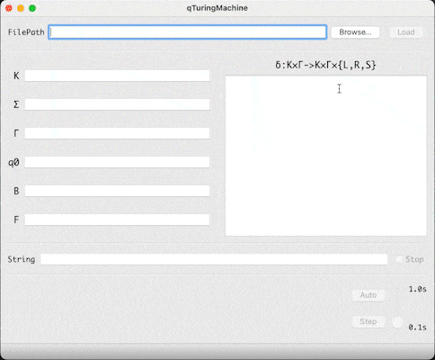

---
github:
  is_project_page: true
  repository_url: https://github.com/w43322/qTuringMachine
  repository_name: qTuringMachine
---

# 单带图灵机模拟器

---

## Demo

## 自述文档

## 技术栈

* C++
* Qt

## 关于

&emsp;&emsp;本项目为东北大学计算机学院计算理论课程设计，完成于2021年12月。
