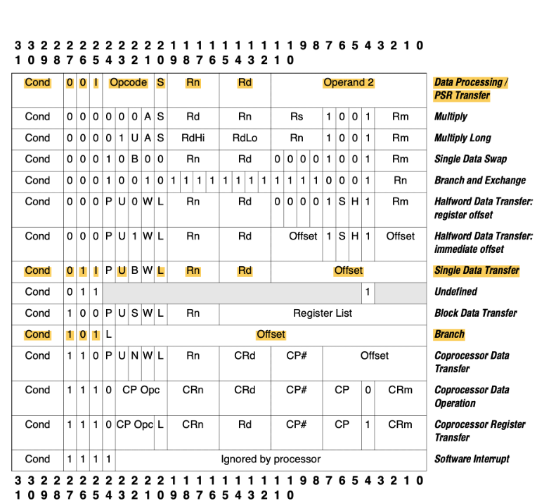
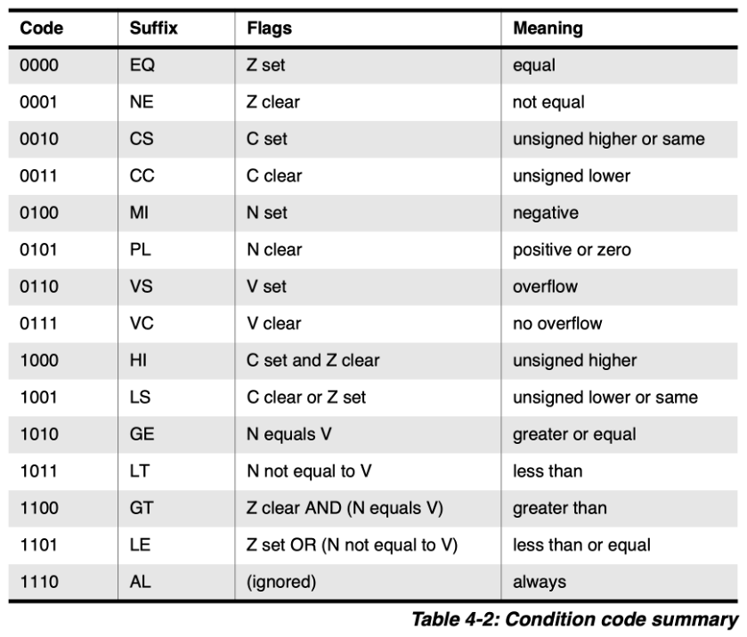
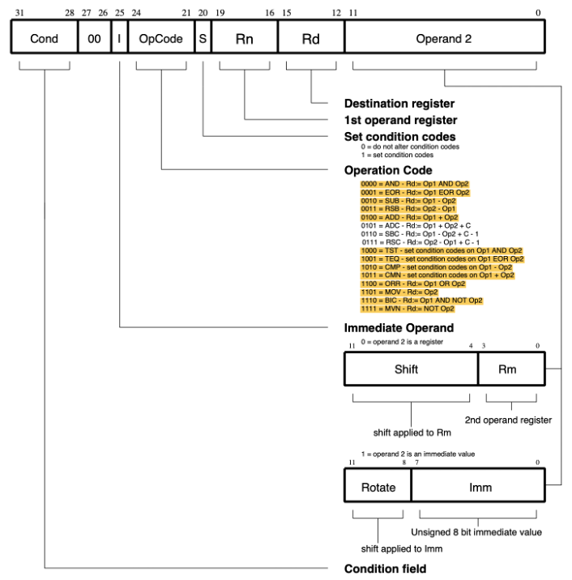
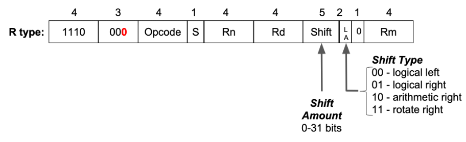
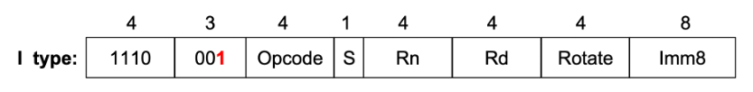
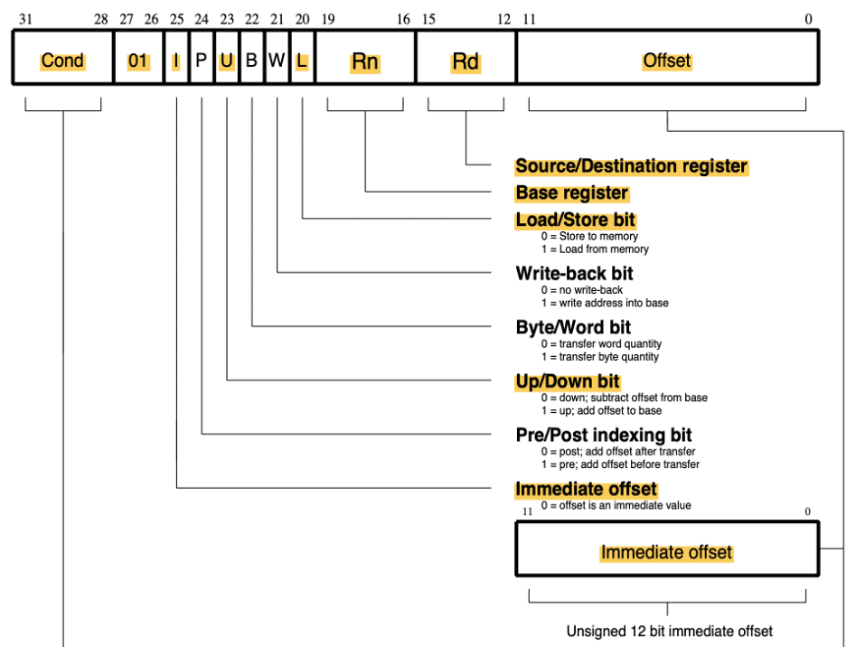
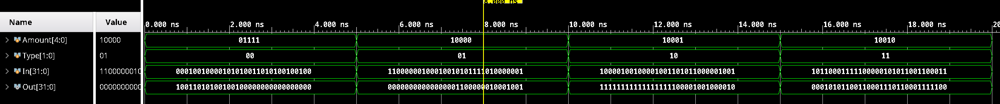
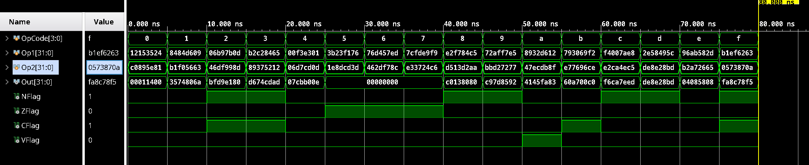
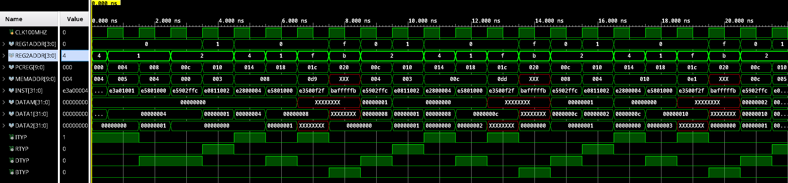
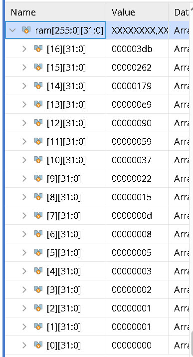

---
github:
  is_project_page: true
  repository_url: https://github.com/w43322/single-cycle-armv7-processor
  repository_name: single-cycle-armv7-processor
---

# 单周期armv7处理器

---

## 实现总结

### 总体框图 (数据通路)

### 指令集

以下内容中，高亮部分为实现的指令。

<table>
  <tr>
    <td></td>
    <td><ul>
      <li style="text-align: left;">R类型：Rn与位移后的Rm做运算，结果存入Rd</li>
      <li style="text-align: left;">I类型：Rn与位移后的imm8做运算，结果存入Rd</li>
      <li style="text-align: left;">D类型：RAM的读写</li>
      <li style="text-align: left;">B类型：跳转</li>
    </ul></td>
  </tr>
</table>

#### 条件判定

<table>
  <tr>
    <td></td>
    <td><ul>
      <li style="text-align: left;">通过当前的标志位判定是否要执行当前指令</li>
      <li style="text-align: left;">由于在一个周期内所有操作都是组合逻辑，实际上这里是决定是否要写入寄存器、标志位和RAM</li>
    </ul></td>
  </tr>
</table>

#### 操作码和ALU指令 (R类型、I类型)

#### 数据传输指令 (D类型)

#### 例程: 求斐波那契数列的前48项

|汇编|机器码|指令类型|
|-|:-:|-|
|`.global _start`| | |
|`_start:`| | |
|&nbsp;&nbsp;&nbsp;&nbsp;`mov r0, #260`|`0xe3a00004`|**I指令**|
|&nbsp;&nbsp;&nbsp;&nbsp;`mov r1, #1`|`0xe3a01001`|**I指令**|
|&nbsp;&nbsp;&nbsp;&nbsp;`str r1, [r0]`|`0xe5801000`|**D指令** - 写入RAM|
|`L0: ldr r2, [r0, #-4]`|`0xe5902ffc`|**D指令** - 读取RAM (带偏移)|
|&nbsp;&nbsp;&nbsp;&nbsp;`add r1, r1, r2`|`0xe0811002`|**R指令**|
|&nbsp;&nbsp;&nbsp;&nbsp;`add r0, #4`|`0xe2800004`|**I指令**|
|&nbsp;&nbsp;&nbsp;&nbsp;`str r1, [r0]`|`0xe5801000`|**D指令** - 写入RAM|
|&nbsp;&nbsp;&nbsp;&nbsp;`cmp r0, #444`|`0xe3500f2f`|**I指令** - 带位移, 写入标志位, 不写入寄存器|
|&nbsp;&nbsp;&nbsp;&nbsp;`blt L0`|`0xbafffffb`|**B指令** - 带条件|
|`L1: b L1`|`0xea000000`|**B指令** - 无条件, 跳转到自身, 相当于停机|

#### 仿真结果

##### 位移模块仿真

##### ALU仿真

##### 斐波那契例程仿真

## 技术栈

* verilog
* arm汇编
* 处理器设计

## 关于

&emsp;&emsp;本项目为东北大学计算机学院数字逻辑与数字系统课程设计，完成于2022年10月。
